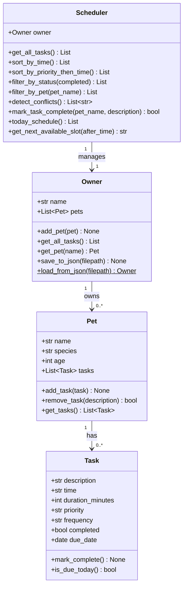

# PawPal+ (Module 2 Project)

You are building **PawPal+**, a Streamlit app that helps a pet owner plan care tasks for their pet.

## Scenario

A busy pet owner needs help staying consistent with pet care. They want an assistant that can:

- Track pet care tasks (walks, feeding, meds, enrichment, grooming, etc.)
- Consider constraints (time available, priority, owner preferences)
- Produce a daily plan and explain why it chose that plan

## What you will build

Your final app should:

- Let a user enter basic owner + pet info
- Let a user add/edit tasks (duration + priority at minimum)
- Generate a daily schedule/plan based on constraints and priorities
- Display the plan clearly (and ideally explain the reasoning)
- Include tests for the most important scheduling behaviors

## Getting started

### Setup

```bash
python -m venv .venv
source .venv/bin/activate  # Windows: .venv\Scripts\activate
pip install -r requirements.txt
```

### Suggested workflow

1. Read the scenario carefully and identify requirements and edge cases.
2. Draft a UML diagram (classes, attributes, methods, relationships).
3. Convert UML into Python class stubs (no logic yet).
4. Implement scheduling logic in small increments.
5. Add tests to verify key behaviors.
6. Connect your logic to the Streamlit UI in `app.py`.
7. Refine UML so it matches what you actually built.

---

## System Architecture (UML)



---

## Features

- **Add Pets** — register any number of pets with name, species, and age.
- **Schedule Tasks** — assign tasks to pets with a time (HH:MM), duration, priority (low / medium / high), and frequency (once / daily / weekly).
- **Priority-Based Sorting** — the scheduler sorts the daily view by priority first (🔴 High → 🟡 Medium → 🟢 Low), then by time within each priority band.
- **Conflict Warnings** — if two tasks for the same pet share a start time, a ⚠️ banner is shown immediately.
- **Recurring Tasks** — marking a daily or weekly task complete automatically creates the next occurrence with the correct due date.
- **Filtering** — filter the schedule by pet name or by completion status (Pending / Completed).
- **Next Available Slot** — the app suggests the next free 30-minute window with no existing task.
- **Data Persistence** — `Owner.save_to_json` / `Owner.load_from_json` let you serialise and restore the full schedule between runs.

## Smarter Scheduling

The algorithmic layer added in Phase 3 includes:

| Feature | Where |
|---|---|
| Sort by time (`sort_by_time`) | `Scheduler` class, `pawpal_system.py` |
| Sort by priority then time (`sort_by_priority_then_time`) | `Scheduler` class |
| Filter by status / pet | `filter_by_status`, `filter_by_pet` |
| Recurring task rescheduling | `Scheduler._reschedule_if_recurring` using `timedelta` |
| Conflict detection | `Scheduler.detect_conflicts` — exact time-match per pet |
| Next available slot | `Scheduler.get_next_available_slot` — scans 30-min windows |

---

## Testing PawPal+

Run the full test suite with:

```bash
python -m pytest
```

The suite (`tests/test_pawpal.py`) covers:

- **Task completion** — `mark_complete()` flips `completed` to `True`.
- **Task addition / removal** — pet task-count changes correctly.
- **Sorting correctness** — chronological order and priority-first order.
- **Recurrence logic** — daily tasks produce +1-day follow-ups; weekly tasks produce +7-day follow-ups; one-off tasks do not recur.
- **Conflict detection** — same-pet / same-time triggers a warning; distinct times do not.
- **Filtering** — status and pet-name filters return only matching tasks.
- **Persistence round-trip** — save + load preserves all owner / pet / task data.

**Confidence level: ⭐⭐⭐⭐ (4 / 5)**
All 15 automated tests pass. The main untested edge case is tasks that span midnight and task durations that overlap without sharing an exact start time.

---

## 📸 Demo

_Run the app with:_

```bash
streamlit run app.py
```
